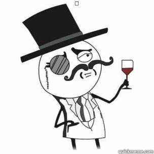

# disculpemebot
Bot para twitter que pide disculpas.
Es un MBV (minimo bot viable) en python basado en tweepy.

**Uso**

Clonar, renombrar disculpemeBot.config.changeME a disculpemeBot.config y rellenar credenciales de twitter.

**Dependencias**

pip install requirements.txt

**Roadmap**

- Revisar porqué los replies no aparecen en timeline del perdonado.
- Mas lógica en las respuestas.
- Control del timeout en el stream y relanzamiento.

**Licencia**

Beer-Ware

 ----------------------------------------------------------------------------
 "THE BEER-WARE LICENSE" (Revision 42):
 <etiorum@gmail.com> wrote this file. As long as you retain this notice you
 can do whatever you want with this stuff. If we meet some day, and you think
 this stuff is worth it, you can buy me a beer in return. Paco Brevers
 ----------------------------------------------------------------------------

